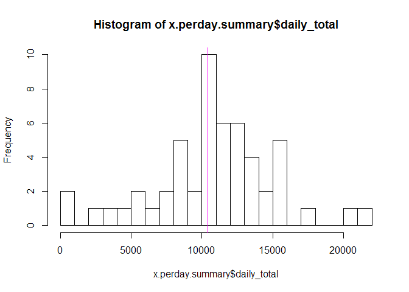
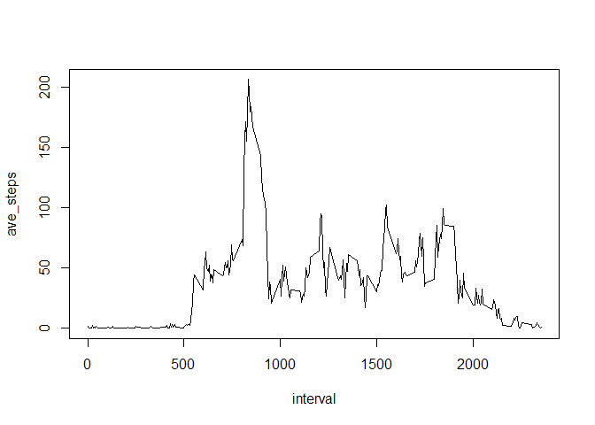
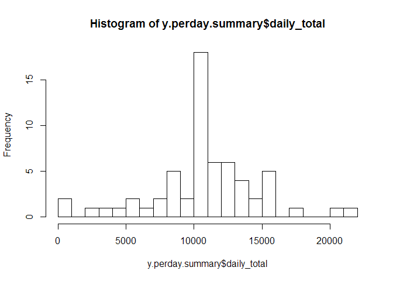
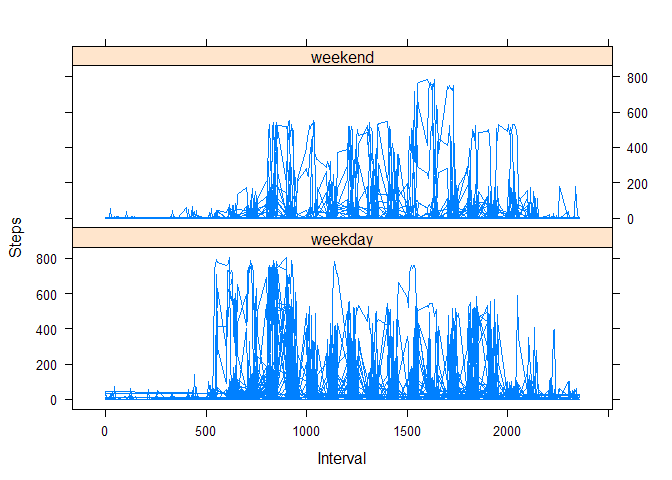

# Reproducible Research: Peer Assessment 1


## Loading and preprocessing the data

```
## R version 3.1.1 (2014-07-10)
## Platform: i386-w64-mingw32/i386 (32-bit)
## 
## locale:
## [1] LC_COLLATE=English_United States.1252 
## [2] LC_CTYPE=English_United States.1252   
## [3] LC_MONETARY=English_United States.1252
## [4] LC_NUMERIC=C                          
## [5] LC_TIME=English_United States.1252    
## 
## attached base packages:
## [1] stats     graphics  grDevices utils     datasets  methods   base     
## 
## loaded via a namespace (and not attached):
## [1] digest_0.6.4     evaluate_0.7     formatR_1.2      htmltools_0.2.6 
## [5] knitr_1.10.5     rmarkdown_0.3.10 stringr_0.6.2    tools_3.1.1     
## [9] yaml_2.1.13
```

```
## [[1]]
## [1] TRUE
## 
## [[2]]
## [1] TRUE
## 
## [[3]]
## [1] TRUE
```

```r
x<-read.csv("activity.csv",header=T,stringsAsFactors=F)
x$date<-ymd(x$date)
x<-mutate(x,dow=ordered(wday(x$date)))
```
## What is mean total number of steps taken per day?

```r
x.perday <- x %>% group_by(date) %>% mutate(daily_total=sum(steps,na.rm=T))
x.perday <- x.perday %>% group_by(interval) %>% mutate(interval_mean=mean(steps,na.rm=T))
x.perday.summary <- x.perday %>% group_by(date) %>% summarize(daily_total=sum(steps))
# Calculate and report the mean and median of the total number of steps taken per day
x.dayofweek <- x.perday %>% group_by(dow) %>% summarize(mean_steps=mean(daily_total))
mean(x.perday.summary$daily_total,na.rm=T)
```

```
## [1] 10766.19
```

```r
median(x.perday.summary$daily_total,na.rm=T)
```

```
## [1] 10765
```

## What is the average daily activity pattern?

```r
hist(x.perday.summary$daily_total,breaks=30)
abline(v=median(x.perday$daily_total),col="magenta")
```

 

```r
x.int <- x %>% group_by(interval) %>% summarize(ave_steps=mean(steps,na.rm=T))

# Make a time series plot (i.e. type = "l") of the 5-minute interval (x-axis) and the average number of steps taken, averaged across all days (y-axis)
with(x.int,plot(interval,ave_steps,type="l")) 
```

 

Which 5-minute interval, on average across all the days in the dataset, contains the maximum number of steps?

```r
x.int[which.max(x.int$ave_steps),]
```

```
## Source: local data frame [1 x 2]
## 
##   interval ave_steps
## 1      835  206.1698
```
## Imputing missing values

```r
mean(is.na(x)) # proportion of NA
```

```
## [1] 0.03278689
```

```r
sum(is.na(x))  # number of rows with NA
```

```
## [1] 2304
```

```r
ind<-which(is.na(x)) #get indicides with NA

# Create a new dataset that is equal to the original dataset but with the missing data filled in.
# replace NAs with the interval mean for that interval
y.perday <- x.perday
y.perday$steps[ind]<-y.perday$interval_mean[ind]
y.perday <- y.perday %>% group_by(date) %>% mutate(daily_total=sum(steps))
y.perday.summary <- y.perday %>% group_by(date) %>% summarize(daily_total=sum(steps))
hist(y.perday.summary$daily_total,breaks=30)
```

 

```r
median(y.perday$daily_total)
```

```
## [1] 10766.19
```

```r
mean(y.perday$daily_total)
```

```
## [1] 10766.19
```

## Are there differences in activity patterns between weekdays and weekends?

```r
# Create a new factor variable in the dataset with two levels - "weekday" and "weekend" indicating whether a given date is a weekday or weekend day.
y.perday$wkdy <- factor((ifelse(weekdays(y.perday$date) %in% c("Saturday","Sunday"), "weekend", "weekday")))

# Make a panel plot containing a time series plot (i.e. type = "l") of the 5-minute interval (x-axis) and the average number of steps taken, averaged across all weekday days or weekend days (y-axis). See the README file in the GitHub repository to see an example of what this plot should look like using simulated data.
xyplot(steps~ interval | wkdy, data=y.perday, layout= c(1,2), main="", ylab = "Steps", xlab="Interval",type="l")
```

 
